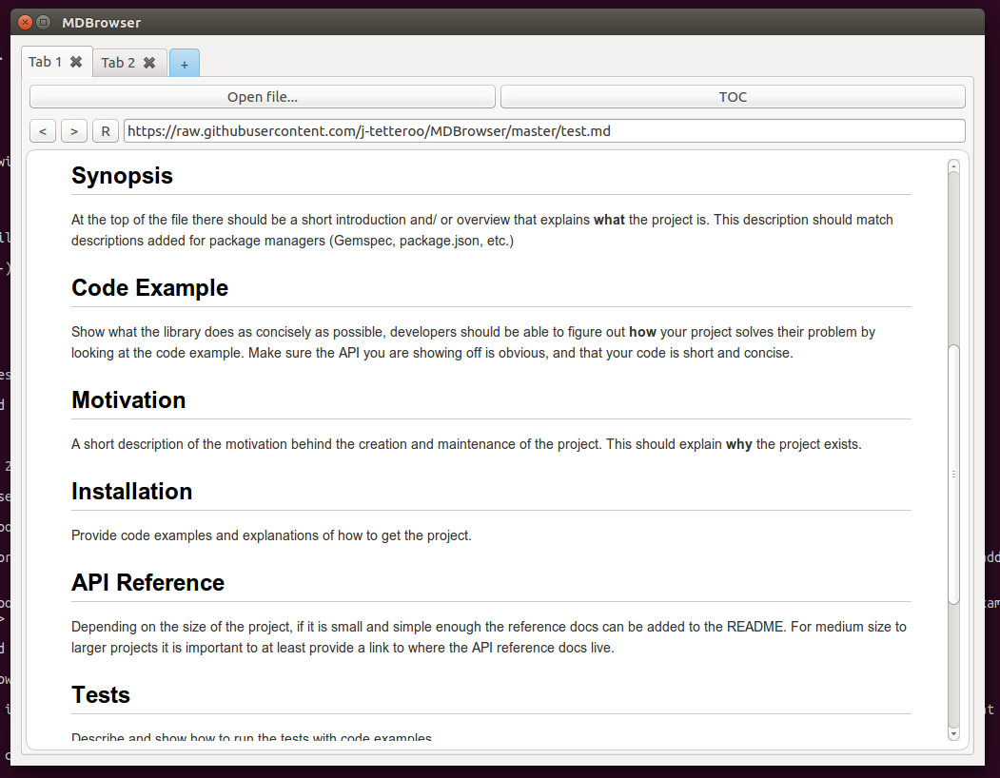

# MDBrowser

### A browser for markdown files.

TODO:
- [ ] Switch between markdown dialects
- [x] Browser tabs
- [ ] Navigation buttons
- [x] Local picture/file rendering
- [x] use Requests instead of urllib2
- [ ] TOC
- [ ] RSS feed rendering
- [ ] manpage rendering
- [x] http error handling
- [ ] prevent html page parsing

